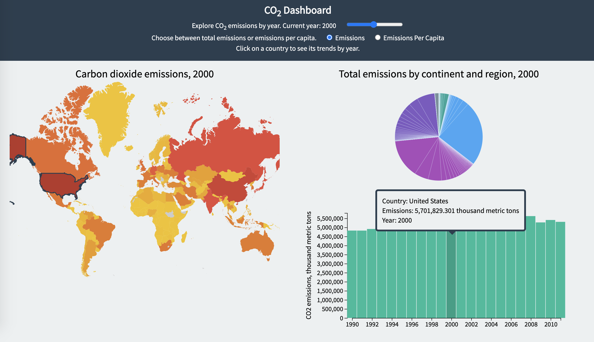

# D3-Dashboard
A Data Dashboard with D3

##Libraries:
* D3.js  (src="https://d3js.org/d3.v7.js")

* topoJson  (src="https://unpkg.com/topojson@3")

##Document Descriptions
* index.html - the index html page
* app.js - load the data and create three containers
* map.js - create and update the map container / highlight the bar when map is clicked
* pie.js - create and update the pie container
* bar.js - create and update the histogram container

##Brief View

